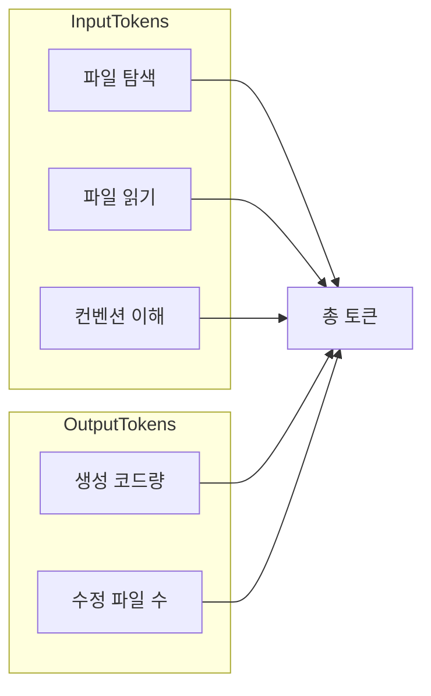
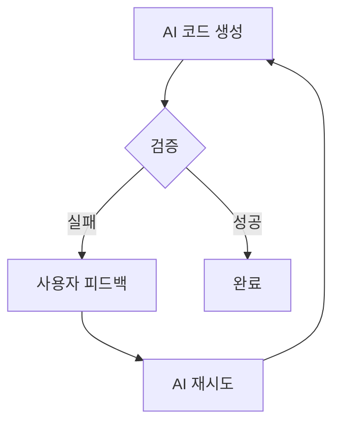

# Aist - AI 최적화 풀스택 프레임워크

**Aist** = AI + Stack. AI가 개발하기에 최적화된 풀스택 프레임워크.

## 핵심 목표 (2가지)

| 순위  | 목표            | 지표                           |
| --- | ------------- | ---------------------------- |
| 1   | **토큰 최소화**    | 동일 기능 구현 시 가장 적은 토큰으로 최상 결과물 |
| 2   | **반복 시도 최소화** | 사용자 의도 달성까지 AI 재시도 횟수 최소화    |

---

## 목표 1: 토큰 최소화

**핵심 지표**: 다른 프레임워크 대비 AI가 동일 기능 구현 시 **가장 적은 토큰**으로 **가장 우수한 결과물** 생성



---

## 목표 2: 반복 시도 최소화

**핵심 지표**: AI가 사용자 의도에 맞는 결과를 **최소 재시도**로 달성

### 반복 시도가 발생하는 원인



| 실패 원인     | 설명              | 프레임워크 대응                    |
| --------- | --------------- | --------------------------- |
| **모호성**   | 요구사항 해석 불일치     | 단일 방식 강제, 선택지 제거            |
| **구조 오류** | export/시그니처 잘못됨 | Fail-fast 검증 + 명확한 에러       |
| **위치 오류** | 잘못된 경로/파일명      | Convention 엄격, 오류 시 즉시 실패   |
| **통합 실패** | 기존 코드와 불일치      | 작은 출력 surface, 예측 가능한 인터페이스 |

### 반복 시도 최소화 전략

| 전략                     | 구현 |
| ---------------------- | --- |
| **단일 방식 (Single-way)** | 페이지/API 추가 방법 1가지만 |
| **Fail-fast 검증**       | dev 서버 기동 시 export/시그니처 검증 |
| **에러 메시지 = 수정 가이드** | `"pages/about.page.js: default export must be function, got undefined"` |
| **작은 출력 surface**      | 1줄 export만 요구 |
| **에러 복구 규칙**           | RULES에 "이 에러 나면 이렇게 수정" 명시 |

---

## AI 작업 유형 (실제 업무 비중 반영)

| 작업 유형                 | 빈도        | 토큰 소비 특성        |
| --------------------- | --------- | --------------- |
| **기능 변경** (UI/데이터 수정) | **가장 많음** | 파일 탐색 + 읽기 + 수정 |
| 페이지 추가                | 적음        | 1파일 생성          |
| API 추가                | 적음        | 1파일 생성          |

---

## 토큰 소비원 및 최소화 전략

| 토큰 소비원               | Nuxt/Next                     | Aist                    |
| -------------------- | ----------------------------- | -------------------------- |
| 라우트 추가 시 읽어야 할 파일    | layout, page 예제, routing docs | **0개**                     |
| 라우트 추가 시 수정할 파일      | page + layout 수정 가능           | **1개** (page만)             |
| API 추가 시 읽어야 할 파일    | handler 예제, middleware        | **0개**                     |
| API 추가 시 수정할 파일      | handler + config              | **1개** (handler만)          |
| **기능 변경 시 읽어야 할 파일** | 여러 파일 탐색, 관련 코드 분산            | **1~2개** (도메인 co-location) |
| **기능 변경 시 수정할 파일**   | 컴포넌트+스타일+로직 분산                | **1개** (1기능=1파일)           |
| 파일당 평균 크기            | 수백~수천 줄                       | **150줄 이하**                |
| Config 파일            | routes, api, app 분산           | **없음** (convention only)   |

---

## 핵심 설계 원칙

| 구분         | Nuxt/Next                   | Aist (토큰 최소)                     |
| ---------- | --------------------------- | ----------------------------------- |
| 라우팅        | 파일 + config 혼합              | **Convention only** - 파일 생성 = 라우트   |
| API        | server/api/ + config        | **Convention only** - 경로 = 엔드포인트    |
| Config     | routes.config, api.config   | **제거** - 파일 구조가 manifest            |
| 기능당 파일 수   | 2~3개 (page, layout, config) | **1파일 = 1기능**                       |
| 보일러플레이트    | framework별 상이               | **5줄 이하** 최소 템플릿                    |
| 언어         | TypeScript 기본               | **JavaScript 우선**, TypeScript 선택 지원 |
| **에러 피드백** | 일반적 에러 메시지                  | **Fail-fast + 수정 가이드** 포함 에러        |
| **방식**     | 여러 방식 혼재                    | **단일 방식** (Single-way) 강제           |

---

## 구현 단계 (Phase 1 → Phase 2)

| Phase | 범위 | 핵심 기능 |
|-------|------|----------|
| **Phase 1** | MVP | SSR, Convention 라우팅/API, 스트리밍, 부분 갱신, 미들웨어, 404/500, 정적 파일 |
| **Phase 2** | 확장 | Islands, 레이아웃, CSRF, 메타/Head |
| **Phase 3** | 고급 | Prerender, Adapter (배포) |

---

## 디렉토리 구조

```
project/
├── pages/                     # 경로 = URL (규칙 1개). 404/500 예약(라우트 아님)
│   ├── index.page.js         # /
│   ├── about.page.js         # /about
│   ├── 404.page.js           # 라우트 미매칭 시
│   ├── 500.page.js           # 서버 에러 시
│   ├── _layout.js            # [Phase 2] 레이아웃 래퍼
│   └── posts/
│       ├── index.page.js     # /posts
│       ├── [id].page.js      # /posts/:id
│       ├── PostList.js       # 이 페이지 전용 (co-location)
│       ├── PostListFilters.js
│       ├── CommentForm.island.js   # [Phase 2] 인터랙티브 Island
│       └── SearchBox.island.js
│
├── api/                       # 경로.메서드 = 엔드포인트 (규칙 1개)
│   ├── users.get.js          # GET /api/users
│   ├── users.[id].get.js     # GET /api/users/:id
│   └── posts.post.js         # POST /api/posts
│
├── components/                # 공통 컴포넌트 (정적)
├── public/                   # 정적 파일 (favicon.ico, 이미지)
├── lib/
├── server/
│   └── _middleware.js        # 요청 전 처리 (redirect, 인증)
└── app.entry.js              # [선택] 클라이언트 진입점 (Phase 2 Islands 등)
```

---

## 1. Convention-only 라우팅

| 파일 경로                     | URL        |
| ------------------------- | ---------- |
| pages/index.page.js       | /          |
| pages/about.page.js       | /about     |
| pages/posts/index.page.js | /posts     |
| pages/posts/[id].page.js  | /posts/:id |

- `[id]` → params.id. 동적 세그먼트.
- `404.page.js`, `500.page.js` → 라우트 아님. 예약(매칭 실패/예외 시 렌더).

---

## 2. 최소 보일러플레이트 페이지

```javascript
// pages/index.page.js
export default () => `<div>Welcome</div>`

// pages/posts/[id].page.js
export default (params) => `<article>Post ${params.id}</article>`
```

---

## 3. Convention-only API

| 파일 경로                 | 엔드포인트              |
| --------------------- | ------------------ |
| api/users.get.js      | GET /api/users     |
| api/users.[id].get.js | GET /api/users/:id |
| api/posts.post.js     | POST /api/posts    |
| api/posts.search.get.js | GET /api/posts/search |

- **경로 규칙**: `api/{path}.{method}.js` — path의 `.`는 `/`로 해석. `posts.search` → `/api/posts/search`. api/ 폴더는 평면 구조.

```javascript
// api/users.get.js — json() 슈거 (import 불필요)
export default () => json([{ id: 1, name: 'User' }])

// api/posts.search.get.js (부분 갱신: HX-Request 시 each()로 HTML 조각)
export default async (req) => {
  const items = await fetchPosts(req.url)
  return req.headers.get('HX-Request')
    ? `<ul>${each(items, r => `<li>${r.title}</li>`)}</ul>`
    : json(items)
}
```

---

## 4. 기능 변경 (UI/데이터 수정)

| 변경 대상         | 파일 위치                            |
| ------------- | -------------------------------- |
| 특정 페이지 UI     | `pages/{route}/` 내               |
| 페이지 전용 컴포넌트   | `pages/{route}/ComponentName.js` |
| [Phase 2] 인터랙티브 영역 | `pages/{route}/ComponentName.island.js` |
| API 응답/로직     | `api/{resource}.{method}.js`     |
| 인증/리다이렉트     | `server/_middleware.js`           |
| 404/500 UI     | `pages/404.page.js`, `pages/500.page.js` |

---

## 5. AI를 위한 코드 슈거

다른 프레임워크(DX)와 달리 Aist 슈거는 **토큰 최소화·단일 방식·AI 생성 용이**에 초점.

| 프레임워크 | 슈거 예 | 목적 |
|-----------|---------|------|
| Vue | `v-if`, `v-for`, `@click` | DX, 선언적 |
| Svelte | `{#if}`, `{#each}`, `$:` | 컴파일타임 최적화 |
| React | JSX, hooks | 컴포넌트 조합 |
| **Aist** | `$`, `each`, `json`, `html` | **AI 생성 토큰 감소, 패턴 단일화** |

### 5.1 글로벌 헬퍼 (전역 주입, import 불필요)

| 헬퍼 | 용도 | before | after |
|------|------|--------|-------|
| `json(data)` | API JSON 응답 | `Response.json(data)` | `json(data)` |
| `html(str)` | HTML 조각 반환 (부분 갱신) | `return \`<ul>...\`` | `html(\`<ul>...\`)` |
| `each(items, fn)` | 리스트 렌더링 | `items.map(...).join('')` | `each(items, i => \`<li>${i}</li>\`)` |
| `$if(cond, then, else)` | 조건부 HTML | `cond ? \`...\` : \`...\`` | `$if(cond, \`...\`, \`...\`)` |
| `redirect(url)` | 리다이렉트 | `Response.redirect(url)` | `redirect(url)` |

- 페이지/API 핸들러 내에서 **import 없이** 사용
- AI가 `Response.json` 대신 `json` 한 단어로 생성 → 토큰 절감

### 5.2 템플릿 태그 (선택)

```javascript
// html`...` — XSS 방지 이스케이프(선택), 동일 인터페이스
export default (params) => html`<article>${params.body}</article>`
```

- `html` tagged template: `${}` 안 값 자동 이스케이프 (선택 구현)
- 없으면 일반 template literal 유지

### 5.3 Island 내부 (Phase 2)

| 슈거 | 용도 |
|------|------|
| `reactive(obj)` | Proxy 반응형 객체 |
| `effect(fn)` | 구독 등록, fn 내 reactive 접근 시 의존성 추적 |

- `@aist/island`에서 전역 또는 import로 제공

### 5.4 규칙

- **단일 방식**: `json` 쓰면 `Response.json` 안 씀. `each` 쓰면 `map().join()` 패턴 안 씀.
- **예측 가능**: 헬퍼 시그니처 명확. AI 규칙에 "리스트 → each", "조건 → $if" 명시.

---

## 6. 렌더링 방식

**선택: Pure SSR (MPA) + HTML 문자열 반환**

| 구분 | 명세 |
|------|------|
| **기본** | 페이지 default export = `() => string` 또는 `(params) => string`. async 지원. |
| **실행 시점** | 요청 시 서버에서 실행, HTML 문자열 생성 |
| **클라이언트 JS** | **0개** — 링크/form은 표준 HTML 동작 |
| **내비게이션** | 전체 페이지 로드 (`<a>` 기본 동작) |
| **스트리밍** | 지원. `ReadableStream` 또는 `async function*` 반환 시 청크 스트리밍 |
| **부분 갱신** | 지원. `HX-Request` 헤더 시 API가 HTML 조각 반환 → 클라이언트 swap |

### 스트리밍

- 페이지가 `ReadableStream` 또는 `AsyncIterable<string>` 반환 시 런타임이 스트리밍 응답
- AI 관점: 문자열을 반환한다는 인식 유지, 스트리밍은 런타임이 자동 처리

### 부분 갱신

- HTMX 호환: `hx-get`, `hx-post` 등으로 요청 시 `HX-Request: true` 헤더
- 해당 API 핸들러가 HTML 조각(문자열) 반환 → 클라이언트가 target에 swap
- 단일 규칙: "부분 갱신 API = HTML 문자열 반환" (JSON/Response 분기 없음)
- **필수**: 부분 갱신 사용 시 레이아웃에 `<script src="https://unpkg.com/htmx.org"></script>` 또는 번들 포함

```
페이지 함수 → string | ReadableStream | AsyncIterable → 서버 응답
부분 갱신 요청 → API가 HTML 조각 반환 → swap
```

---

## 7. 미들웨어, 에러 페이지, 정적 파일

### 7.1 미들웨어

| 구분 | 명세 |
|------|------|
| **파일** | `server/_middleware.js` |
| **형식** | `export default (req, next) => next(req)` 또는 `redirect(url)` |
| **실행** | 모든 요청 전. `next(req)` → 페이지/API 진행, `redirect()` → 즉시 응답. 없으면 생략. |

```javascript
// server/_middleware.js
export default (req, next) => {
  if (!req.headers.get('cookie')?.includes('auth') && req.url.includes('/admin'))
    return redirect('/login')
  return next(req)
}
```

### 7.2 에러 페이지

| 파일 | 용도 |
|------|------|
| `pages/404.page.js` | 라우트 미매칭 시 렌더 |
| `pages/500.page.js` | 핸들러 예외 시 렌더 |

- 형식 동일: `export default () => \`<h1>Not Found</h1>\``
- 404/500는 예약. `/404`, `/500` URL로 접근 불가. 라우터가 매칭 실패/예외 시 해당 페이지 렌더.
- 404.page.js, 500.page.js 없으면 기본 HTML 응답 (심플 fallback).

### 7.3 정적 파일

| 구분 | 명세 |
|------|------|
| **폴더** | `public/` |
| **매핑** | `/favicon.ico` → `public/favicon.ico` |
| **우선순위** | 정적 파일 매칭 시 페이지 라우트보다 우선 |

### 7.4 요청 처리 순서

```
1. 미들웨어 (server/_middleware.js) — redirect 시 여기서 종료
2. 정적 파일 (public/) — 매칭 시 파일 반환 후 종료
3. API (api/*.get|post.js) — /api/* 경로
4. 페이지 (pages/*.page.js) — 매칭 실패 시 404.page.js
5. 핸들러 예외 → 500.page.js
```

---

## 8. Phase 2: Islands, 레이아웃, CSRF, 메타

### 8.1 Islands

| 구분 | 명세 |
|------|------|
| **위치** | `pages/{route}/ComponentName.island.js` (co-location) |
| **형식** | export default → Web Component 클래스 또는 `() => \`<tag-name>\`` |
| **사용** | 페이지 HTML에 `<component-name>` 또는 `<search-box>` 삽입 |
| **Hydration** | 해당 태그만 선택적 hydrate, 나머지 페이지는 0 JS |
| **상태** | Island 내부 로컬만. 전역 store 없음. 서버가 진실의 원천 |

```javascript
// pages/posts/CommentForm.island.js
export default class CommentForm extends HTMLElement {
  connectedCallback() { /* ... */ }
}
customElements.define('comment-form', CommentForm)
```

### 8.2 레이아웃

| 구분 | 명세 |
|------|------|
| **파일** | `pages/_layout.js` 또는 `pages/{route}/_layout.js` |
| **형식** | `export default (content) => \`<html><body>${content}</body></html>\`` |
| **적용** | 자식 페이지 렌더 결과를 content 인자로 받아 감싸기 |
| **중첩** | 페이지 → 직계 _layout 감싸기 → 상위 _layout 감싸기. 최종 루트 _layout 출력이 응답. |
| **Phase 1** | _layout 없으면 기본 `<html><body>${content}</body></html>` 래퍼 적용. |

```javascript
// pages/_layout.js
export default (content) => `
  <html>
    <head><title>Aist</title></head>
    <body><header>...</header><main>${content}</main></body>
  </html>
`
```

### 8.3 상태관리

| 구분 | 방식 |
|------|------|
| **페이지/필터/정렬** | URL query (`?page=2&q=검색어`) |
| **폼 입력** | `<form>` submit → 서버 처리 |
| **인증/세션** | 쿠키 |
| **부분 갱신** | 요청 URL/폼에 컨텍스트 포함, 서버가 HTML 반환 |
| **Island 내부** | Proxy 기반 반응형. `state.count = 1` → 구독자 갱신. 전역 store 미지원 |

**Proxy 반응형 알고리즘**

- `get`: 현재 effect를 해당 key 구독자에 등록
- `set`: 구독자에 알림 → `queueMicrotask`로 배칭 후 effect 재실행
- `reactive(obj)`, `effect(fn)` 제공. Island 내부에서 `state = reactive({ count: 0 })` 사용

### 8.4 CSRF

| 구분 | 명세 |
|------|------|
| **대상** | POST, PUT, PATCH, DELETE 요청 |
| **방식** | 미들웨어 또는 API 런타임에서 토큰 검증 |
| **토큰** | 쿠키 + 헤더/폼 필드 매칭. SameSite cookie |

### 8.5 메타/Head 확장

| 구분 | 명세 |
|------|------|
| **용도** | 페이지별 title, meta SEO |
| **형식** | 레이아웃 시그니처 확장: `(content, ctx)` — ctx.path로 meta 선택. 단일 방식. |

---

## 9. 구현할 핵심 모듈

**패키지 네이밍**: `@aist/router`, `@aist/page`, `@aist/server`, `@aist/validator`, `@aist/vite`, `@aist/island`, `create-aist-app`

| 모듈            | 패키지명           | Phase | 역할                                 |
| ------------- | ---------------- | ----- | ---------------------------------- |
| Router        | @aist/router     | 1     | pages/ 스캔 → convention 라우팅         |
| Page          | @aist/page       | 1     | SSR HTML 생성, 스트리밍, 0 JS 기본       |
| API Runtime   | @aist/server     | 1     | api/ 스캔, 미들웨어 실행, 정적 파일 서빙   |
| Validator     | @aist/validator  | 1     | dev 시 export/시그니처 검증. 404/500.page.js는 라우트 제외, 형식만 검증. Fail-fast. |
| Vite Plugin   | @aist/vite       | 1     | pages/, api/ 스캔, HMR, 검증 훅 연동      |
| Island        | @aist/island     | 2     | *.island.js → Web Component, Proxy 반응형, 선택적 hydration |
| CLI           | create-aist-app  | 1     | 프로젝트 생성 + RULES.md                 |

**코드 슈거**: `json`, `html`, `each`, `$if`, `redirect` — Page/Server 런타임이 핸들러 실행 시 전역 주입. 별도 패키지 없음.

---

## 10. AI 규칙 (.cursor/rules/framework.md)

```markdown
## 렌더링 (단일 방식)
- 페이지 = SSR. export default 함수가 HTML 문자열(또는 ReadableStream) 반환.
- 클라이언트 JS 없음. 링크/폼은 표준 HTML 동작.
- 스트리밍: ReadableStream/async generator 반환 시 자동.
- 부분 갱신: API가 HTML 조각 반환. hx-get 등 + HX-Request 헤더.

## 라우트 추가
- 파일: pages/{path}.page.js
- 내용: export default () => `html` 또는 (params) => `html`

## 미들웨어
- 파일: server/_middleware.js
- 내용: export default (req, next) => next(req) 또는 redirect(url)

## 에러 페이지
- 404: pages/404.page.js. 500: pages/500.page.js. 형식 동일.

## 정적 파일
- public/ 폴더. /path → public/path

## API 추가
- 파일: api/{path}.{get|post|put|patch|delete}.js
- 내용: export default (req) => json(data) 또는 html(str)
- json(), html(), each(), $if(), redirect() — import 없이 사용

## 코드 슈거
- 리스트: each(items, i => \`<li>${i}</li>\`)
- 조건: $if(cond, \`then\`, \`else\`)
- API JSON: json(data). API HTML 조각: html(str)

## [Phase 2] Islands 추가
- 파일: pages/{route}/ComponentName.island.js (co-location)
- 내용: export default class extends HTMLElement → customElements.define
- 사용: 페이지 HTML에 <component-name> 삽입

## [Phase 2] 레이아웃
- 파일: pages/_layout.js 또는 pages/{route}/_layout.js
- 내용: export default (content) => `html with ${content}`

## [Phase 2] CSRF
- POST/PUT/PATCH/DELETE 시 토큰 검증. SameSite cookie.

## [Phase 2] 메타/Head
- 레이아웃 (content, ctx). ctx.path 기준 title/meta.

## 상태관리
- 전역 store 없음. URL, 폼, 쿠키.
- Island 내부: Proxy 기반 반응형 (state.key = value → effect 재실행).

## 기능 변경
- UI: pages/{경로}/ 검색
- API: api/{리소스}.{메서드}.js 검색

## 에러 복구
- "Expected default export" → export default 함수 확인
- "Handler must export" → export default (req)=>Response 확인
- 404 → 경로, 확장자 확인
```

---

## 구현 순서

### Phase 1

1. Monorepo 설정 (pnpm workspace)
2. Router 패키지 (@aist/router) — 404 라우트 처리
3. Page 패키지 (@aist/page) — 스트리밍 지원
4. Server 패키지 (@aist/server) — 미들웨어, 정적 파일, 500 처리
5. Validator 패키지 (@aist/validator)
6. Vite 플러그인 (@aist/vite)
7. CLI (create-aist-app)
8. 통합 예제 앱 (미들웨어, 404/500, public 포함)

### Phase 2

9. Island 패키지 (@aist/island)
10. Page에 Island 삽입, 레이아웃 중첩 연동
11. CSRF, 메타/Head 확장
12. Phase 2 예제 앱

### Phase 3

13. Prerender (빌드 시 정적 HTML)
14. Adapter (Vercel, Netlify, Node 등 배포)

---

## 11. Phase 3: Prerender, Adapter (구현 완료)

### 11.1 Prerender

| 구분 | 명세 |
|------|------|
| **패키지** | @aist/build |
| **함수** | `prerender(opts)` — 정적 라우트 HTML 생성 |
| **출력** | `.output/public/` — index.html, about/index.html, _islands/, _aist/ |
| **동적 라우트** | opts.routes에 경로 추가 (예: `['/posts/1']`) |

```javascript
import { prerender } from '@aist/build'
await prerender({
  root, pagesDir, apiDir, publicDir, serverDir,
  outDir: '.output/public',
  routes: ['/posts/1', '/posts/2']  // 동적 라우트 추가
})
```

### 11.2 Adapter

| 어댑터 | 패키지 | 빌드 출력 | 실행 |
|--------|--------|-----------|------|
| **Node** | @aist/adapter-node | .output/ (pages, api, server.js) | `node .output/server.js` |
| **Vercel** | @aist/adapter-vercel | .output/ (api/index.js, vercel.json) | `vercel deploy` |
| **Netlify** | @aist/adapter-netlify | .output/ (netlify/functions, netlify.toml) | `netlify deploy` |

### 11.3 예제 빌드 명령

```bash
pnpm run build        # Node 어댑터 (기본)
pnpm run build:static # Prerender만 (.output/public)
pnpm run build:node   # Node 어댑터
pnpm run build:vercel # Vercel 어댑터
pnpm run build:netlify # Netlify 어댑터
```

### 11.4 Router 확장

- `getStaticRoutes(routes)` — [id] 등 동적 세그먼트 제외한 정적 라우트만 반환
