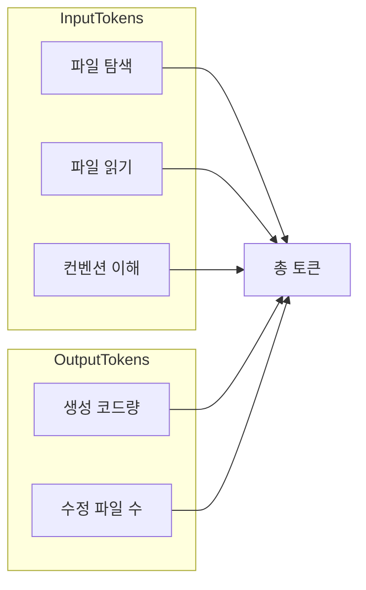
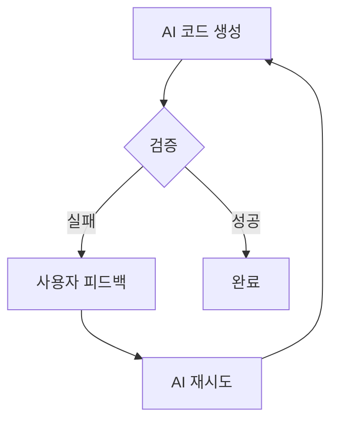

# Aist - AI 최적화 풀스택 프레임워크

**Aist** = AI + Stack. AI가 개발하기에 최적화된 풀스택 프레임워크.

## 핵심 목표 (2가지)

| 순위  | 목표            | 지표                           |
| --- | ------------- | ---------------------------- |
| 1   | **토큰 최소화**    | 동일 기능 구현 시 가장 적은 토큰으로 최상 결과물 |
| 2   | **반복 시도 최소화** | 사용자 의도 달성까지 AI 재시도 횟수 최소화    |

---

## 목표 1: 토큰 최소화

**핵심 지표**: 다른 프레임워크 대비 AI가 동일 기능 구현 시 **가장 적은 토큰**으로 **가장 우수한 결과물** 생성



---

## 목표 2: 반복 시도 최소화

**핵심 지표**: AI가 사용자 의도에 맞는 결과를 **최소 재시도**로 달성

### 반복 시도가 발생하는 원인



| 실패 원인     | 설명              | 프레임워크 대응                    |
| --------- | --------------- | --------------------------- |
| **모호성**   | 요구사항 해석 불일치     | 단일 방식 강제, 선택지 제거            |
| **구조 오류** | export/시그니처 잘못됨 | Fail-fast 검증 + 명확한 에러       |
| **위치 오류** | 잘못된 경로/파일명      | Convention 엄격, 오류 시 즉시 실패   |
| **통합 실패** | 기존 코드와 불일치      | 작은 출력 surface, 예측 가능한 인터페이스 |

### 반복 시도 최소화 전략

| 전략                     | 구현 |
| ---------------------- | --- |
| **단일 방식 (Single-way)** | 페이지/API 추가 방법 1가지만 |
| **Fail-fast 검증**       | dev 서버 기동 시 export/시그니처 검증 |
| **에러 메시지 = 수정 가이드** | `"pages/about.page.js: default export must be function, got undefined"` |
| **작은 출력 surface**      | 1줄 export만 요구 |
| **에러 복구 규칙**           | RULES에 "이 에러 나면 이렇게 수정" 명시 |

---

## AI 작업 유형 (실제 업무 비중 반영)

| 작업 유형                 | 빈도        | 토큰 소비 특성        |
| --------------------- | --------- | --------------- |
| **기능 변경** (UI/데이터 수정) | **가장 많음** | 파일 탐색 + 읽기 + 수정 |
| 페이지 추가                | 적음        | 1파일 생성          |
| API 추가                | 적음        | 1파일 생성          |

---

## 토큰 소비원 및 최소화 전략

| 토큰 소비원               | Nuxt/Next                     | Aist                    |
| -------------------- | ----------------------------- | -------------------------- |
| 라우트 추가 시 읽어야 할 파일    | layout, page 예제, routing docs | **0개**                     |
| 라우트 추가 시 수정할 파일      | page + layout 수정 가능           | **1개** (page만)             |
| API 추가 시 읽어야 할 파일    | handler 예제, middleware        | **0개**                     |
| API 추가 시 수정할 파일      | handler + config              | **1개** (handler만)          |
| **기능 변경 시 읽어야 할 파일** | 여러 파일 탐색, 관련 코드 분산            | **1~2개** (도메인 co-location) |
| **기능 변경 시 수정할 파일**   | 컴포넌트+스타일+로직 분산                | **1개** (1기능=1파일)           |
| 파일당 평균 크기            | 수백~수천 줄                       | **150줄 이하**                |
| Config 파일            | routes, api, app 분산           | **없음** (convention only)   |

---

## 핵심 설계 원칙

| 구분         | Nuxt/Next                   | Aist (토큰 최소)                     |
| ---------- | --------------------------- | ----------------------------------- |
| 라우팅        | 파일 + config 혼합              | **Convention only** - 파일 생성 = 라우트   |
| API        | server/api/ + config        | **Convention only** - 경로 = 엔드포인트    |
| Config     | routes.config, api.config   | **제거** - 파일 구조가 manifest            |
| 기능당 파일 수   | 2~3개 (page, layout, config) | **1파일 = 1기능**                       |
| 보일러플레이트    | framework별 상이               | **5줄 이하** 최소 템플릿                    |
| 언어         | TypeScript 기본               | **JavaScript 우선**, TypeScript 선택 지원 |
| **에러 피드백** | 일반적 에러 메시지                  | **Fail-fast + 수정 가이드** 포함 에러        |
| **방식**     | 여러 방식 혼재                    | **단일 방식** (Single-way) 강제           |

---

## 디렉토리 구조

```
project/
├── pages/                     # 경로 = URL (규칙 1개)
│   ├── index.page.js         # / 
│   ├── about.page.js         # /about
│   └── posts/
│       ├── index.page.js     # /posts
│       ├── [id].page.js       # /posts/:id
│       ├── PostList.js        # 이 페이지 전용 (co-location)
│       └── PostListFilters.js  # 이 페이지 전용
│
├── api/                       # 경로.메서드 = 엔드포인트 (규칙 1개)
│   ├── users.get.js          # GET /api/users
│   ├── users.[id].get.js     # GET /api/users/:id
│   └── posts.post.js         # POST /api/posts
│
├── components/
├── lib/
├── server/
└── app.entry.js
```

---

## 1. Convention-only 라우팅

| 파일 경로                     | URL        |
| ------------------------- | ---------- |
| pages/index.page.js       | /          |
| pages/about.page.js       | /about     |
| pages/posts/index.page.js | /posts     |
| pages/posts/[id].page.js  | /posts/:id |

---

## 2. 최소 보일러플레이트 페이지

```javascript
// pages/index.page.js
export default () => `<div>Welcome</div>`

// pages/posts/[id].page.js
export default (params) => `<article>Post ${params.id}</article>`
```

---

## 3. Convention-only API

| 파일 경로                 | 엔드포인트              |
| --------------------- | ------------------ |
| api/users.get.js      | GET /api/users     |
| api/users.[id].get.js | GET /api/users/:id |
| api/posts.post.js     | POST /api/posts    |

```javascript
// api/users.get.js
export default (req) => Response.json([{ id: 1, name: 'User' }])
```

---

## 4. 기능 변경 (UI/데이터 수정)

| 변경 대상       | 파일 위치                            |
| ----------- | -------------------------------- |
| 특정 페이지 UI   | `pages/{route}/` 내               |
| 페이지 전용 컴포넌트 | `pages/{route}/ComponentName.js` |
| API 응답/로직   | `api/{resource}.{method}.js`     |

---

## 5. 구현할 핵심 모듈

**패키지 네이밍**: `@aist/router`, `@aist/page`, `@aist/server`, `@aist/validator`, `@aist/vite`, `create-aist-app`

| 모듈            | 패키지명           | 역할                                 |
| ------------- | ---------------- | ---------------------------------- |
| Router        | @aist/router     | pages/ 스캔 → convention 라우팅         |
| Page          | @aist/page       | Web Component 최소 래퍼 (1줄 export)    |
| API Runtime   | @aist/server     | api/ 스캔 → convention 핸들러 실행        |
| Validator     | @aist/validator  | dev 시 export/시그니처 검증, Fail-fast 에러 |
| Vite Plugin   | @aist/vite       | pages/, api/ 스캔, HMR, 검증 훅 연동      |
| CLI           | create-aist-app  | 프로젝트 생성 + RULES.md                 |

---

## 6. AI 규칙 (.cursor/rules/framework.md)

```markdown
## 라우트 추가
- 파일: pages/{path}.page.js
- 내용: export default () => `html` 또는 (params) => `html`

## API 추가
- 파일: api/{path}.{get|post|put|patch|delete}.js
- 내용: export default (req) => Response

## 기능 변경
- UI: pages/{경로}/ 검색
- API: api/{리소스}.{메서드}.js 검색

## 에러 복구
- "Expected default export" → export default 함수 확인
- "Handler must export" → export default (req)=>Response 확인
- 404 → 경로, 확장자 확인
```

---

## 구현 순서

1. Monorepo 설정 (pnpm workspace)
2. Router 패키지 (@aist/router)
3. Page 패키지 (@aist/page)
4. Server 패키지 (@aist/server)
5. Validator 패키지 (@aist/validator)
6. Vite 플러그인 (@aist/vite)
7. CLI (create-aist-app)
8. 통합 예제 앱
